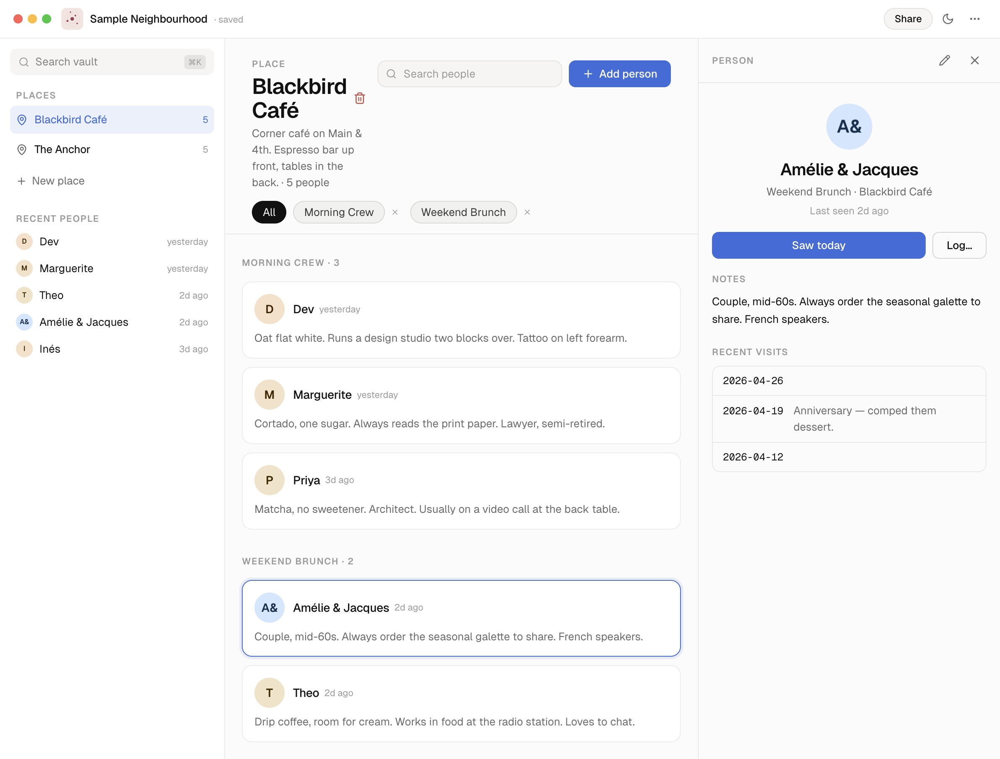

<p align="center">
  
</p>

<h1 align="center">MyRegulars</h1>

<p align="center">
  A personal notebook for remembering the names and faces of regulars at your favourite local spots.
</p>

<p align="center">
  
</p>

---

## What it does

MyRegulars helps you track the people you see regularly at cafes, gyms, co-working spaces, or any venue you frequent. Never forget a name again.

- **Vaults** — Each vault is a self-contained notebook backed by a GitHub Gist. Create as many as you like, share them read-only, or clone someone else's.
- **Places** — Organize people by location (e.g. "Morning Cafe", "Friday Gym").
- **Groups** — Within a place, split people into groups (e.g. "Staff", "Regulars", "Dog walkers").
- **People** — Record names, key details, photos, pets, and visit history for each person.
- **Visit logging** — One-tap "seen today" tracking with optional notes.
- **Version history** — Every save is versioned. Browse, view, or revert to any past state of your vault.
- **Sharing** — Generate a QR code or share link so others can view (read-only) or clone your vault.
- **Offline-friendly** — Cached locally for fast loads; syncs to GitHub Gists when online.
- **Dark mode** — Full light/dark theme support.
- **Responsive** — Mobile-first design with a desktop sidebar layout.

## Tech stack

| Layer      | Technology                           |
| ---------- | ------------------------------------ |
| Framework  | Next.js (App Router)                 |
| Language   | TypeScript (strict)                  |
| Styling    | Tailwind CSS                         |
| Data store | GitHub Gists (one gist = one vault)  |
| Validation | Zod                                  |
| Auth       | GitHub OAuth (personal access token) |
| Testing    | Vitest + React Testing Library       |
| E2E        | Playwright                           |

## Getting started

```bash
# Install dependencies
npm install

# Run the dev server
npm run dev
```

Open [http://localhost:3000](http://localhost:3000) and sign in with your GitHub account.

## Scripts

| Command                       | Purpose                                       |
| ----------------------------- | --------------------------------------------- |
| `npm run dev`                 | Start development server                      |
| `npm run build`               | Production build                              |
| `npm run format-and-validate` | Format, typecheck, lint, and test in one pass |
| `npm test`                    | Run unit/component tests (Vitest)             |
| `npm run test:e2e`            | Run end-to-end tests (Playwright)             |

## Project structure

```
src/
  app/              # Next.js App Router pages and API routes
  components/       # React components (UI primitives + features)
  lib/              # Core logic — datastore adapters, context, utilities
    datastore/      # Pluggable storage layer (GitHub Gist adapter)
docs/               # Design assets and reference material
e2e/                # Playwright end-to-end tests
```

## License

Private project.
